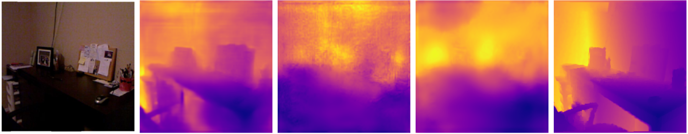

# Feature-based Knowledge Distillation for Monocular Depth Estimation
- **Group ID**: G22
- **Project ID**: 29

---

## 1. Introduction and Objective
The main goal of this project is to close the gap between high accuracy and computational efficiency. I believe that a lightweight "Student" model can achieve depth prediction accuracy similar to a large "Teacher" model if it receives proper guidance. To tackle this, I put in place a Feature-based Knowledge Distillation (KD) framework. This framework aims to compress the spatial and geometric understanding of a large Teacher into compact edge-compatible architectures without sacrificing real-time performance.

## 2. Contribution and Added Value
I built a detailed PyTorch Lightning pipeline to train, distill, and evaluate MDE models. My specific contributions and added value include:
 -  Architectural Exploration: I evaluated and compared models of different scales. This ranged from a heavy ResNet-50 to a standard ResNet-18, a highly optimized MobileNetV3-Small, and a Custom CNN designed from scratch. 
 -  Feature-based Distillation: Instead of just calculating the loss on the final depth map outputs, which is standard distillation, I used effective KD techniques. These techniques specifically targeted the encoder features to transfer rich relational and spatial representations from the Teacher's latent space to the Student.

## 3. Data Used
For these experiments, I used the 'NYU Depth V2' dataset, a standard benchmark for indoor depth estimation.
 - **Source**: Hugging Face datasets implementation (sayakpaul/nyu_depth_v2).
 - **Statistics**: the data is split into 47,584 samples for training and 654 samples for validation/testing.
 - **Preprocessing and Augmentation**: To prepare the data and prevent overfitting, I applied a robust augmentation pipeline via torchvision.transforms.v2:
    > Training: Images and depth maps were resized to 280x280 with anti-aliasing, randomly cropped to 256x256, and subjected to Random Horizontal Flips (p=0.5).
    > Validation: Images were deterministically resized to 256x256 and center-cropped.
    > Normalization: RGB inputs were normalized using standard ImageNet statistics (Mean: [0.485, 0.456, 0.406], Std: [0.229, 0.224, 0.225]). Depth maps were scaled by a factor of 10.0 to stabilize the gradient during training.

## 4. Methodology and Architecture
This system is built using the PyTorch Lightning framework. It has two parts: `BaselineTask` for standard supervised learning and `EncoderDistillationTask` for Knowledge Distillation.

### 4.1 Network Topology and Baselines
I worked on Monocular Depth Estimation (MDE) as a regression task. This task maps a 3-channel RGB input to a 1-channel spatial depth map. Instead of creating large architectures from scratch, I used the `timm` (PyTorch Image Models) library. This library helps create multi-scale feature extractors.
Models: 
 -  The Teacher: A high-capacity **ResNet-50** (`resnet50`).
 -  The Students (Baselines): I tested a **ResNet-18** (`resnet18`) and a compressed **MobileNetV3-Small** (`mobilenetv3_small_100`). 
 I also made a custom CNN (`Model_depth`) from scratch that dynamically adapts for all three models.

### 4.2 Feature-Based Knowledge Distillation Framework
Standard KD typically relies on minimizing the divergence between the final output logits of the Teacher and the Student. However, in spatial tasks like MDE, the intermediate geometric representations are crucial. Therefore, I extracted intermediate activation maps from both encoders and applied Attention and Relational KD to force the Student's latent space to mimic the Teacher's multi-scale spatial hierarchy.

### 4.3 Loss Functions
The overall objective function during the KD training is a weighted sum of the primary task loss and the distillation loss:
$$\mathcal{L}_{total} = \mathcal{L}_{task} + \lambda \mathcal{L}_{KD}$$

* **Task Loss (Masked MAE)**: The ground truth depth maps in NYU Depth V2 contain invalid or unmeasured pixels (zeros). To prevent the network from learning false artifacts, I apply a boolean mask (`depths > 0`). The task loss is purely computed on valid depth pixels using Mean Absolute Error (L1 Loss):
  $$\mathcal{L}_{L1} = \frac{1}{N_{valid}} \sum_{i \in valid} \left| y_i - \hat{y}_i \right|$$
* **Distillation Loss ($\mathcal{L}_{KD}$)**: Computes the feature alignment error between the Teacher's and Student's intermediate representations, projecting the Student's features to match the Teacher's channel dimensions where necessary.

## 5. Results and Discussion
While the numbers show that Knowledge Distillation works well in lowering errors, the biggest advantage of my method is actually how it looks.
Usually small models have trouble creating smooth depth changes because they don't have enough parameters. This looks bad with patchy areas and unclear edges. By using Knowledge Distillation with Attention and Relational losses it's possible to fix this problem. I teach the model called the Student to copy the spatial awareness of the bigger model called the Teacher. This way the network learns to keep the structure of the scene intact.
The result is a cleaner depth map. This isn't about making it look nicer to people; it's about giving reliable data for other tasks, like self-driving cars or 3D reconstruction. These systems need consistent measurements to work safely and well without sudden noisy spikes. Knowledge Distillation helps achieve this, making it a valuable tool.

**Table 1**: Quantitative results

| Modello | MAE (L1) | Parametri (M) | Inferenza (ms) | FPS |
| :--- | :---: | :---: | :---: | :---: |
| Teacher (ResNet-50) | 0.0408 | 66.32 | 190.09 | 5.3 |
| Baseline (ResNet-18) | 0.0469 | 14.0 | 84.96 | 11.8 |
| KD Student (ResNet-18) | 0.0444 | 14.0 | 84.96 | 11.8 |
| Baseline (Custom Mini 2) | 0.0712 | 1.90 | 25.82 | 38.7 |
| KD Student (Custom Mini 2) | 0.0674 | 1.90 | 25.82 | 38.7 |
| Baseline (MobileNetV3_100) | 0.0593 | 1.06 | 8.69 | 115.1 |
| KD Student (MobileNetV3_100)| 0.0640 | 1.06 | 8.69 | 115.1 |

Figure 1: Qualitative comparison of the predictions. From left to right: RGB Input, Teacher (ResNet-50), Baseline (MobileNetV3_100), KD Student (MobileNetV3_100), and Ground Truth. It is clearly noticeable how Knowledge Distillation helps reduce the "patchy" effect visible in the baseline model, yielding smoother gradients that are more consistent with the structure of the scene.

## 6. Conclusion and Limitations
The small models are really fast and do not use a lot of power. However, estimating depth from a single 2D picture is a very hard task. Because of this, the depth maps generated by my small models are not perfectly accurate. Real indoor rooms are very complicated: they have mirrors, varying light, and plain texture-less walls. The good thing about this project is that it finds a balance between speed and accuracy. I found out that I can make a model better without making it slower. This shows that I need to be smart about how I train models if I want to use them in real-time on small devices like robots. Edge AI and robots that can work in real-time are going to be important in the future. Small models and Knowledge Distillation are a big part of this.

### 7.1 Contribution Breakdown
- **Angelo Spadola**: Developed the PyTorch Lightning pipeline, implemented the Baseline and KD training logic, integrated the models, handled data preprocessing, ran all experiments, and drafted the final report.

### 7.2 Use of Artificial Intelligence
During the development of this project, I responsibly utilized Large Language Models (specifically Gemini) strictly as coding assistants. Their usage was limited to:
 -  Generating boilerplate code for argparse and Matplotlib visualization functions.
 -  Debugging PyTorch Lightning configuration errors and Hugging Face dataset connection issues.
 -  Cleaning up my English and fixing typos to make the documentation easier to read.